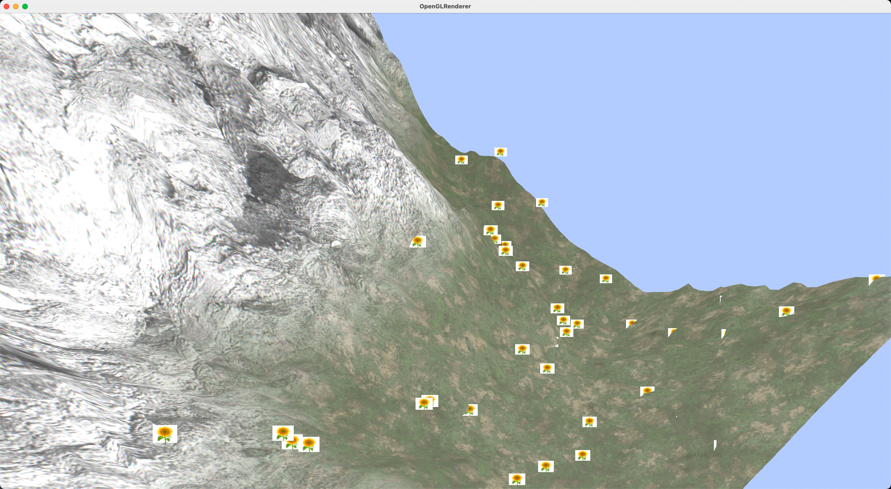
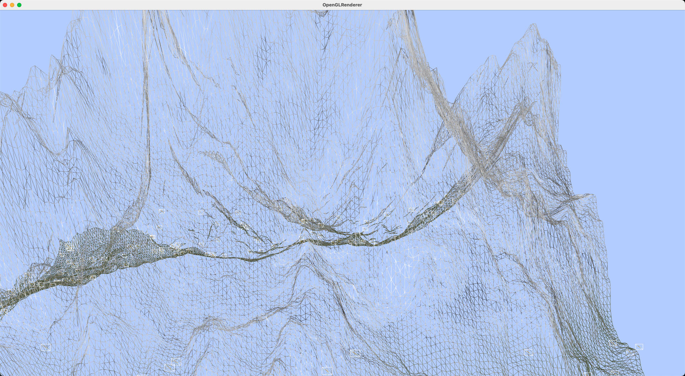
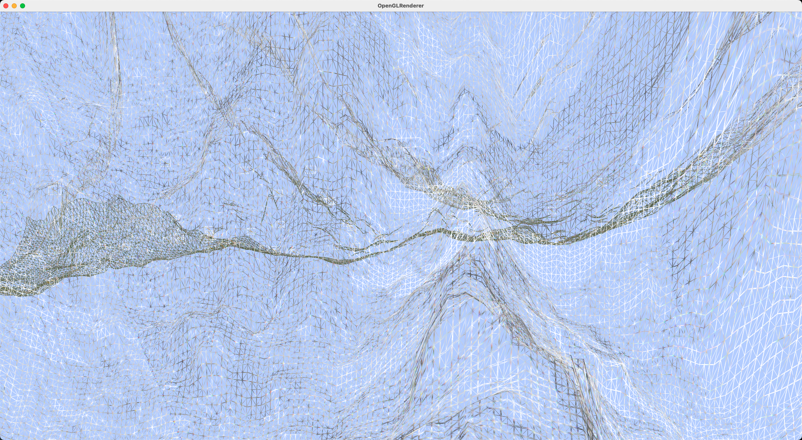
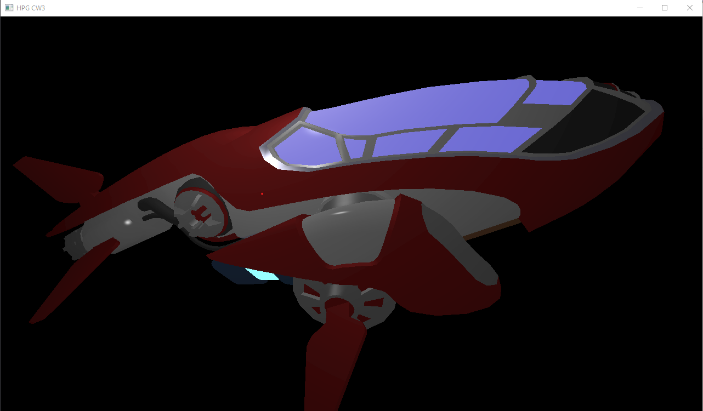

# HPG Showcase

P.S. Some of the less well-developed and unrelated(like some MATLAB projects and some deep learning projects) demo projects are not showed here.

## Animation And Simulation

### IK

### Cloth simulation

### SPH

## Geometric Processing

### Polygon converter

No GUI.

### Subdivision

### UV mapping

## Rendering

### Ray tracer

### Soft renderer

### Shaders(vert + geom + tesc + tese + frag)

## Vulkan

### Baseline

### PBR

### Deferred rendering(use subpass) and HDR

### Shadow

